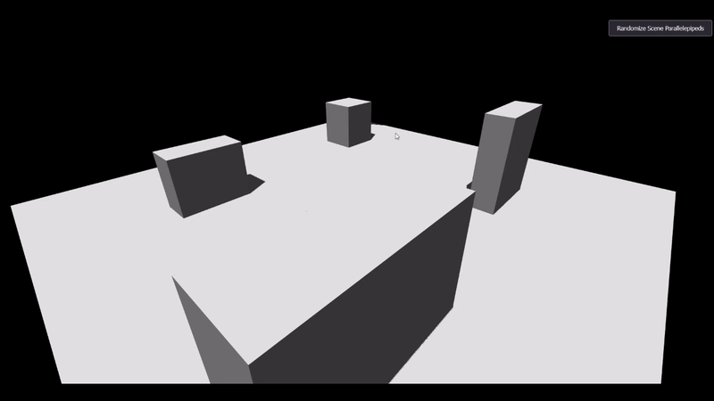

# Shadow Mapping project developed for the course of Interactive Graphics in Engineering in CS (Sapienza) 2023/2024

## What is Shadow Mapping

"Shadows are created by testing whether a pixel is visible from the light source, by comparing the pixel to a z-buffer or depth image of the light source’s view, stored in the form of a texture."

Shadow mapping is a technique used in 3D graphics to calculate the shadows cast by an object on the scene. It works in two main stages:
1) Shadow map generation:
    The scene is rendered from the point of view of the light, but instead of calculating the colors, you store the distances of the objects from the light in a texture called a shadow map.
2) Using the shadow map:
    During the final rendering, for each point visible from the camera, the distance from the light (calculated from the visible point) is compared with the value in the shadow map. 
    If the point is further away than the value in the shadow map, it means it is in the shadow.

It works alongside rasterization to add shadows. 
It uses a pre-computed map to determine which points are illuminated or in shadow.
Shadows depend on the resolution of the shadow map and may appear "pixelated" or affected by artifacts without optimizations.
Less expensive than ray tracing, but more complex than basic rasterization.

## How to use

- Download the src code as a .zip file;
- Extract all the content in a folder;
- Open the .html file and make sure every file remains as it is inside the extracted folder.
- Interact with the UI and have fun discovering the implemented features :)

## Static Shadow Map on Parallelepipeds

## Static Shadow Map on Spheres

## Dynamic Shadow Map on Parallelepipeds

## Dynamic Shadow Map on Spheres

