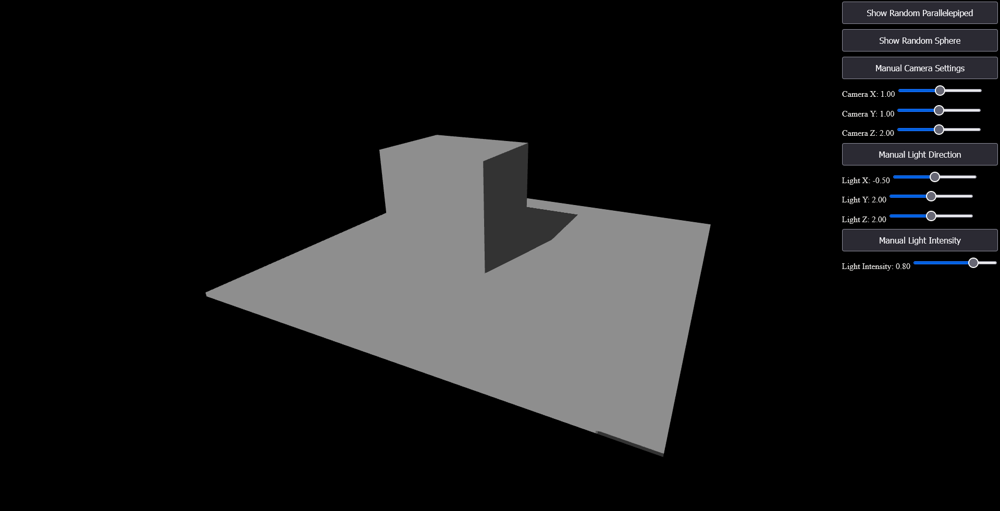
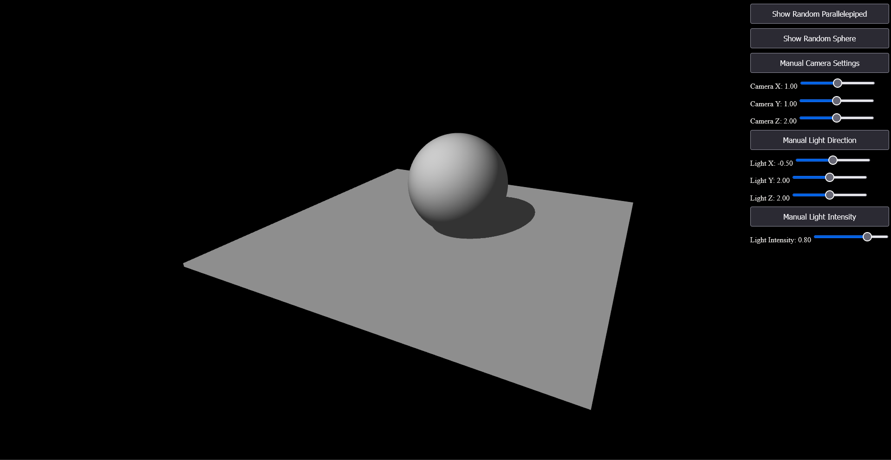

# Shadow Mapping project developed for the course of Interactive Graphics in Engineering in CS (Sapienza) 2023/2024

## How to use

- Download the src code as a .zip file;
- Extract all the content in a folder;
- Open the .html file and make sure every file remains as it is inside the extracted folder.
- Interact with the UI and have fun discovering the implemented features :)

## Static Shadow Map on Parallelepipeds

## Static Shadow Map on Spheres

## Dynamic Shadow Map on Parallelepipeds

## Dynamic Shadow Map on Spheres
